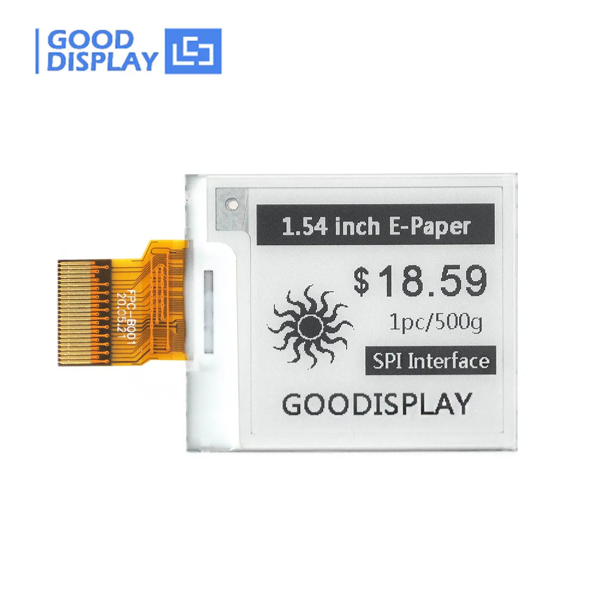
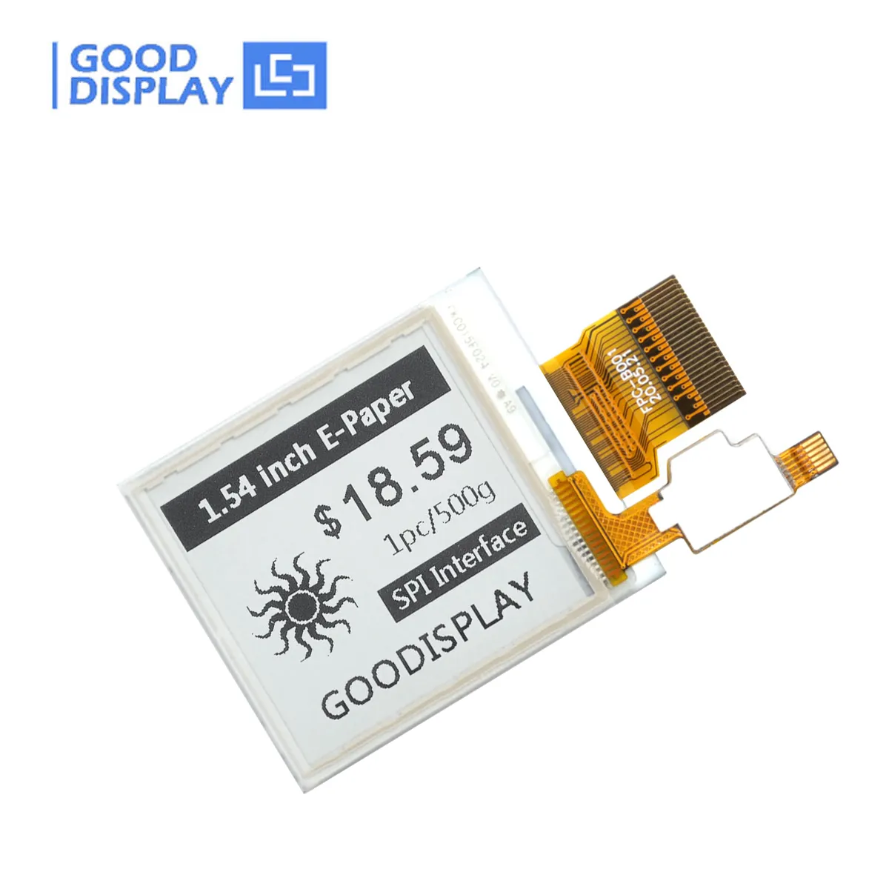

# GDEY0154D67-esp32-driver

A driver for e-paper GDEY0154D67/GDEY0154D67-T03 based on `esp-idf v4.4.6`.

**GDEY0154D67** is a 1.54 inch e-paper display with 200x200 resolution and partial screen update designed by [Good Display](https://www.good-display.com/).
It integrates an [SSD1681](https://www.buydisplay.com/download/ic/SSD1681.pdf) driver IC.



**GDEY0154D67-T03** is its variant with a touch panel whose driver IC is [FT6336](https://www.buydisplay.com/download/ic/FT6236-FT6336-FT6436L-FT6436_Datasheet.pdf).



## Installation

This driver is designed as a **component** in an ESP-IDF project.
To use it, you need to add it as a submodule in your project.

```bash
git submodule add https://github.com/MaxwellJay256/GDEY0154D67-esp32-driver.git components/<module-name>
```
You need to change `<module-name>` to the name you want, e.g. `epaper`.

- Or, you can download the latest [release](https://github.com/MaxwellJay256/GDEY0154D67-esp32-driver/releases) and extract it to `components/<module-name>`.

If there are no extra components like this driver in your project yet, add the following line to your `CMakeLists.txt` under the project root directory.

```cmake
set(EXTRA_COMPONENT_DIRS "./components")
```

## Usage

Please refer to [usage.md](./docs/usage.md) for detailed guide and examples.

## References

- [GDEY0154D67-ESP32-SampleCode (Arduino)](https://www.good-display.com/companyfile/612.html)
- [GDEY0154D67-T03 - buy-lcd.com](https://buy-lcd.com/products/154-inch-e-paper-display-200x200-resolution-partial-screen-update-touch-eink-display-gdey0154d67-t03)
- [电子墨水屏电子纸触摸屏1.54寸D67 - 大连佳显电子 (Taobao)](https://item.taobao.com/item.htm?spm=a1z10.5-c.w4002-1995619223.10.145a6581VpCF4I&id=577513991073)
- [嵌入式单片机教程-桌面小屏幕实战教学 - Bilibili](https://www.bilibili.com/video/BV1wV4y1G7Vk)