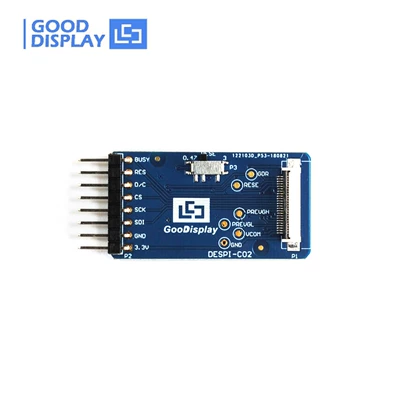

# GDEY0154D67-esp32-driver 使用指南

## 1 快速上手

### 1.1 硬件连接

GDEY0154D67 需要通过 24 pin FPC 接口连接到 ESP32，大连佳显为此提供了[转接板 DESPI-C02](https://item.taobao.com/item.htm?id=582446457306)（如下图），你也可以使用自制的开发板或转接板。



GDEY0154D67 的各个引脚在驱动中的对应关系在 [`include/epd_basic.h`](../include/epd_basic.h) 中定义：

```c
// IO settings
#define EPD_BUSY GPIO_NUM_13 // Busy pin, 1-busy 0-idle
#define EPD_RES GPIO_NUM_12  // Reset pin, 1-normal 0-reset
#define EPD_DC GPIO_NUM_14   // Data/Command, 1-data 0-command
#define EPD_CS GPIO_NUM_27   // Chip Select, 1-inactive 0-active
// SPI settings
#define EPD_SPI_MISO GPIO_NUM_23 // MISO signal
#define EPD_SPI_MOSI GPIO_NUM_26 // MOSI signal
#define EPD_SPI_CLK GPIO_NUM_25  // CLK signal
```

用户可以按照自己的实际连接情况修改这些宏定义。

### 1.2 将你的 esp-idf 工程升级为 C++ 工程

由于本组件使用了 C++ 特性，所以使用时必须将你的 esp-idf 工程升级为 C++ 工程。

假设原本的主程序文件名为 `main.c`：
1. 将 `main.c` 重命名为 `main.cpp`。
2. 同步修改 `main` 文件夹下的 `CMakeLists.txt`。将 `idf_component_register(SRCS "main.c" ...)` 改为 `idf_component_register(SRCS "main.cpp" ...)`。
3. 修改 `main.cpp` 中的入口函数 `app_main`。将 `void app_main()` 改为 `extern "C" void app_main()`。
4. 为了使你的工程中的其他 `.c` 文件中的函数能在 `main.cpp` 中被正确链接，你需要为这些 C 函数使用 C 链接声明，具体请参考 [C++ 支持/在 C++ 中进行开发 - ESP-IDF 编程指南](https://docs.espressif.com/projects/esp-idf/zh-CN/latest/esp32/api-guides/cplusplus.html#id6)。

### 1.3 示例：Hello World

使用本驱动时，只需在主程序中包含 [`epd.h`](../include/epd.h) 即可，因为它包含了其余几个头文件。

以下是一个简单的示例程序，在墨水屏上用全局刷新打印 “Hello World!”。

```c
#include <stdio.h>
#include "freertos/FreeRTOS.h"
#include "freertos/task.h"
#include "epd.h"

extern "C" void app_main(void)
{
    epd_init_all();
    epd_clear_screen(EPD_WHITE);

    Paint canvas_1;
    canvas_1.clear(EPD_WHITE);
    canvas_1.draw_string(0, 0, "Hello World!", &Font16, EPD_BLACK, EPD_WHITE);
    canvas_1.print_full();
    
    epd_deep_sleep();
}
```

理想的显示效果：


